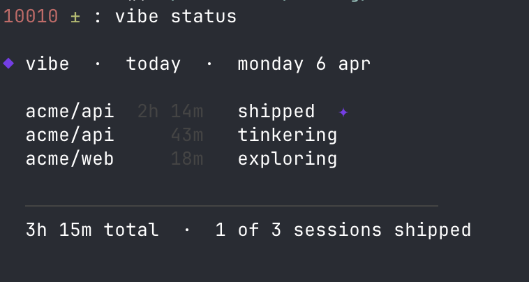
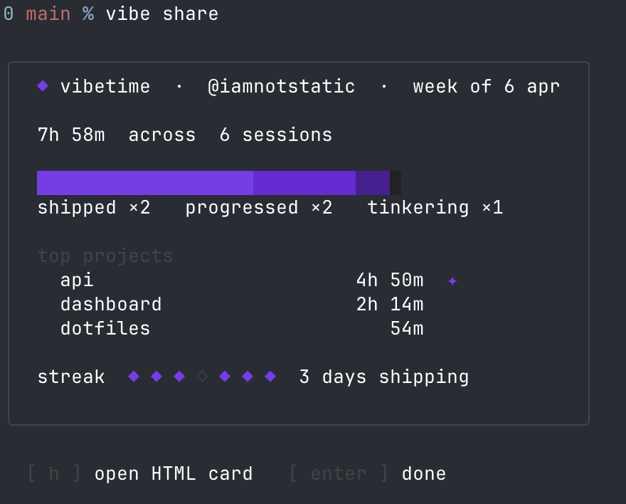
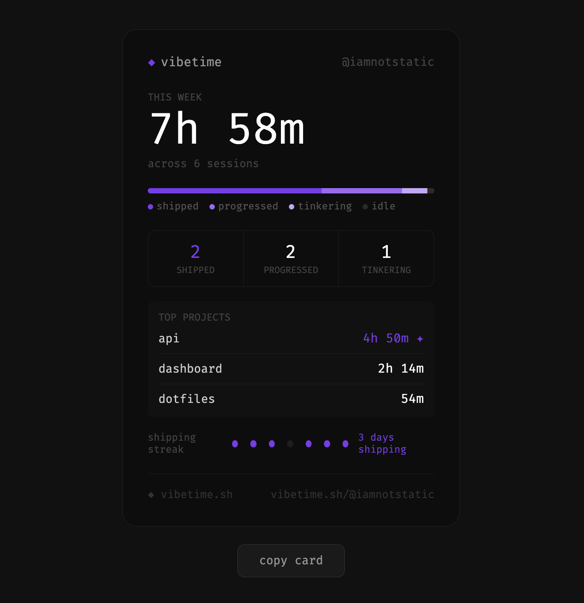

# ◆ Vibetime

Track what you actually ship with AI.

Vibetime wraps Claude Code, Codex, and Gemini and prints a session summary every time you're done. No config, no account, no daemon.



## Install

```
npm install -g vibetime
```

## Setup

```
vibe init
```

Adds shell hooks that wrap `claude`, `codex`, and `gemini`. The tools work exactly the same — Vibetime just snapshots your git state before and after each session, then prints the endcard when you're done.

## What you get

Every time you close a Claude Code, Codex, or Gemini session:

```
╭─────────────────────────────────────────────╮
│  ◆ vibe  ·  acme/api  ·  2h 14m      │
├─────────────────────────────────────────────┤
│                                             │
│  3 commits  ·  +847 −231  ·  12 files      │
│                                             │
│  ████████░░  shipped  ✦                     │
│                                             │
╰─────────────────────────────────────────────╯
```

Sessions are scored by what happened in git:

| tier | bar | meaning |
|---|---|---|
| shipped | `████████░░` | commits + meaningful changes |
| progressed | `██████░░░░` | commits, small changes |
| tinkering | `████░░░░░░` | changes but no commits |
| exploring | `██░░░░░░░░` | a few lines touched |
| idle | `░░░░░░░░░░` | nothing changed |

## Share your week

Run `vibe share` to print your weekly card. Press `h` to open the HTML version — copy it, screenshot it, post it.

<p>
  
  
</p>

## Adding more tools

Vibetime wraps any AI CLI. To track a tool not listed above:

```
vibe config add-tool aider
```

## Commands

```
vibe status                  today's sessions
vibe log                     last 20 sessions
vibe share                   weekly summary card
vibe share --html            shareable HTML card
vibe config show             current settings
vibe config set handle       set your @handle
vibe config add-tool <name>  track a new AI CLI tool
```

## License

[MIT](LICENSE)
